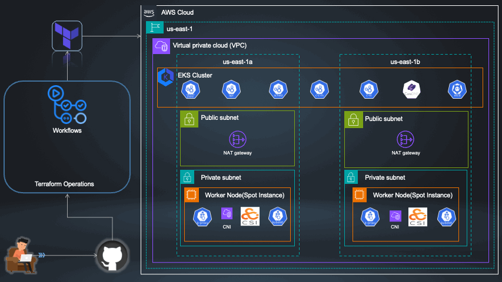

# 🚀 Configuring Production-Ready EKS Clusters with Terraform and GitHub Actions

Welcome to the repository for **Configuring Production-Ready EKS Clusters with Terraform and Automating with GitHub Actions**! This repository accompanies my blog post and demonstrates the practical steps to set up and automate an EKS cluster.

## 🌟 Overview
This project covers:
- **Infrastructure as Code (IaC)**: Use Terraform to define and manage your EKS cluster.
- **CI/CD Automation**: Leverage GitHub Actions to automate deployments.

## 🌟 Comprehensive Guide
For a detailed guide, please refer to my [blog post on Medium](https://medium.com/p/c046e8d44865).

## 🤝 Contributing
Contributions are welcome! Please open an issue or submit a pull request for any improvements or bug fixes.

